# Plateforme de Gestion des Experts en Ligne(Group Consulting )
La plateforme **Group Consulting** est développée avec Laravel pour gérer les consultations dans différents domaines.


## Technologies Utilisées
- **Frontend**: laravel
- **Backend** : laravel
- **Base de Données** : Mysql

---


### **Authentification Utilisateur/administrateur/Expert :**
- Écran de connexion pour les utilisateurs inscrits.
- Écran d’inscription pour les nouveaux utilisateurs.
- Déconnexion sécurisée.


### Pour l'Admin
- Inscription et connexion
- Gestion des domaines
- Gestion des experts
- Suivi des disponibilités des experts
- Liste des clients

### Pour l'Expert
- Inscription et connexion
- Gestion des consultations
- Édition du profil
- Gestion des disponibilités

### Pour l'Utilisateur
- Inscription et connexion
- Demande de consultation
- Gestion des consultations
- Consultation de la liste des experts
- Liste historique des consultations avec option de suppression
- Accès à la section "À propos" pour découvrir les services de la plateforme "Group Consulting"

---

## **le interface de utilisateur**
### **1. login**
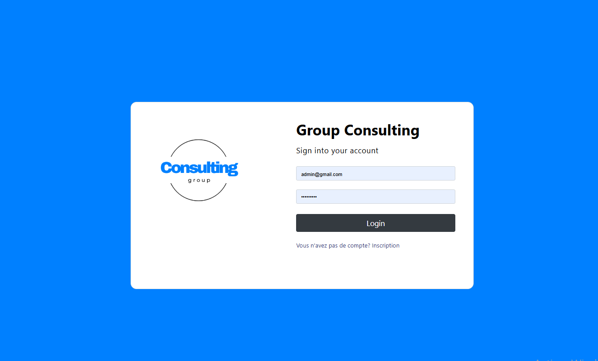
### **2. inscrit**
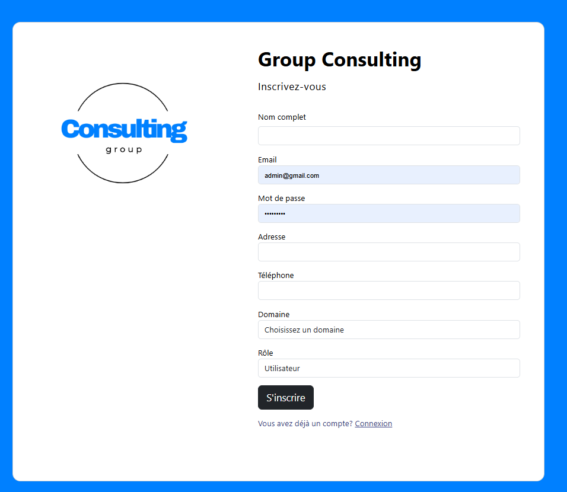

### **3. Interface utilisateur**


---

### **4. a propos interface user **
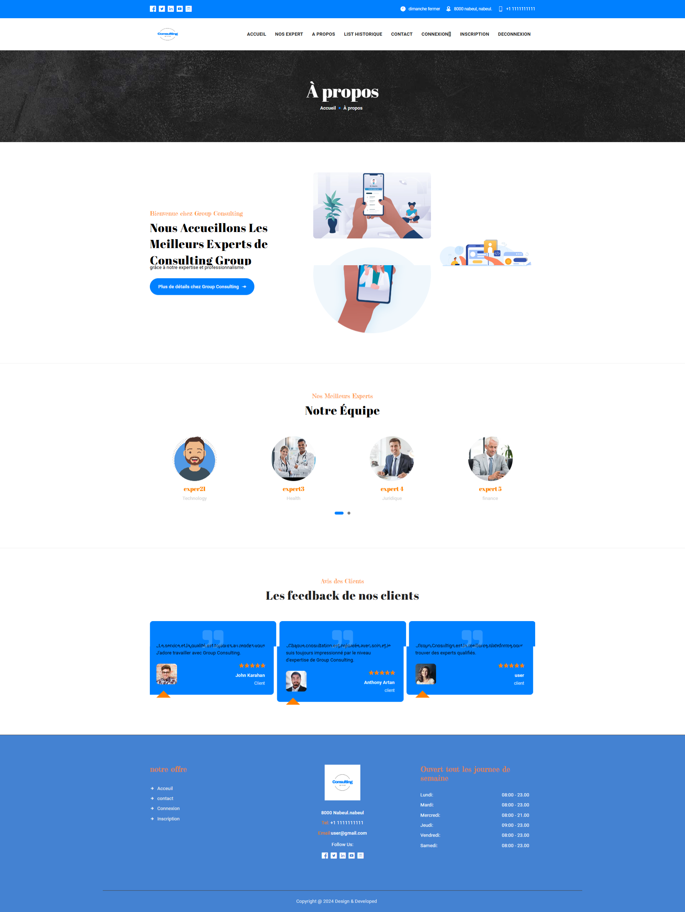


---
### **5. liste des expert interface user**
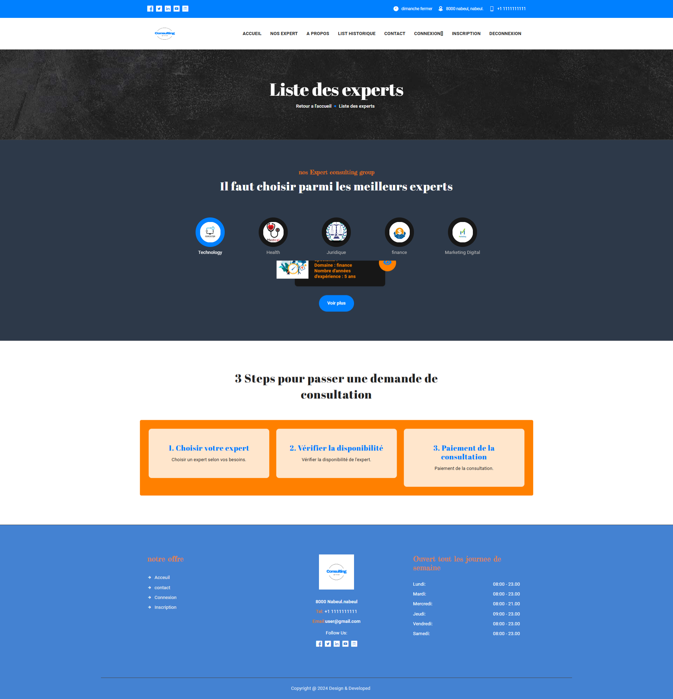

---
### **6. experrt detaille**
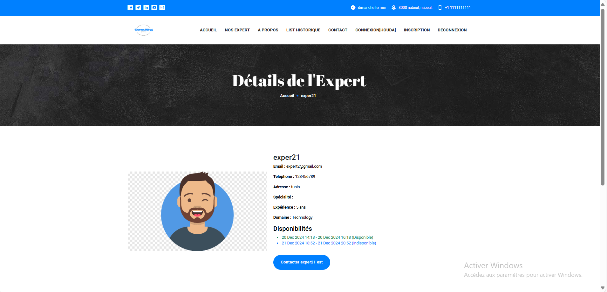
----
### **7. historique des consultaion**
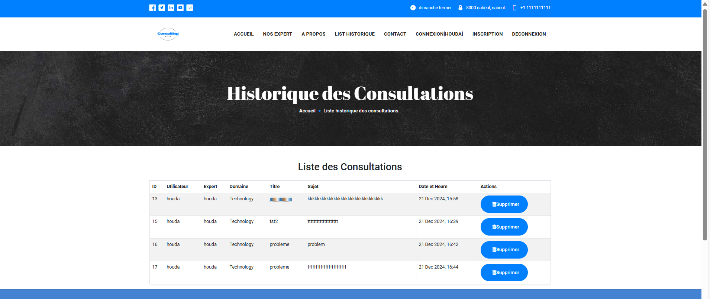
----

## **le interface de expert**

### **4. Profil de l’Expert**
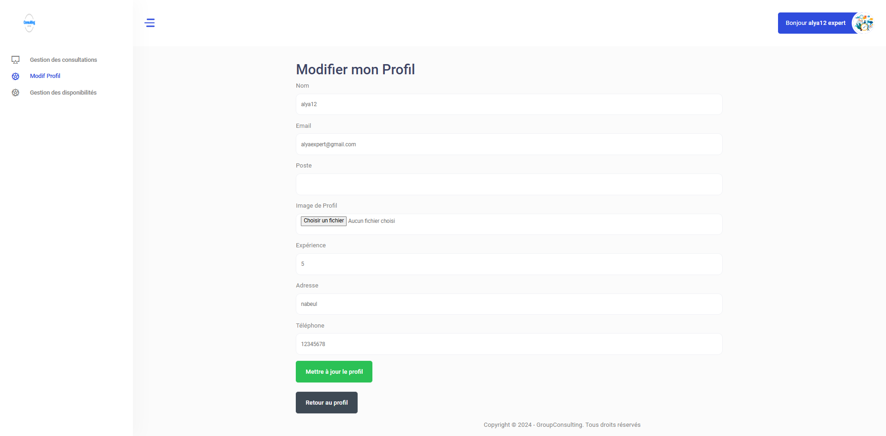

---


### **5. Gestion des Disponibilités**
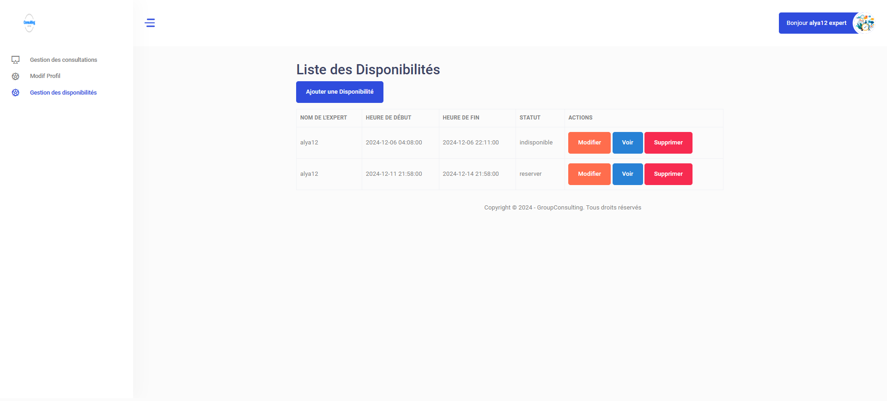
---
## **le interface de  admin **
### **1. Gestion des domaine**
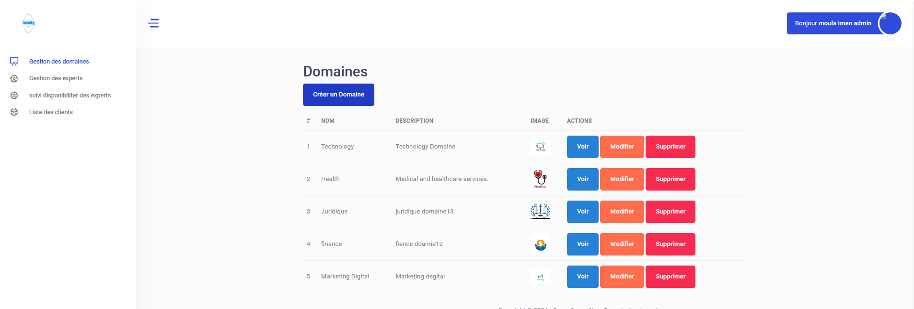
---
### **2. Gestion des expert**
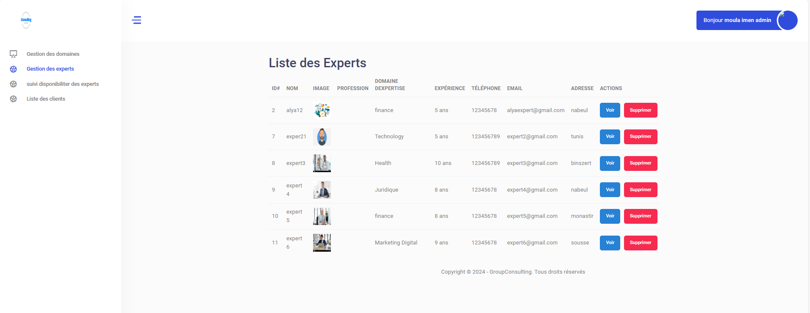
---
### **3. suiv disponibiliet dexpert**
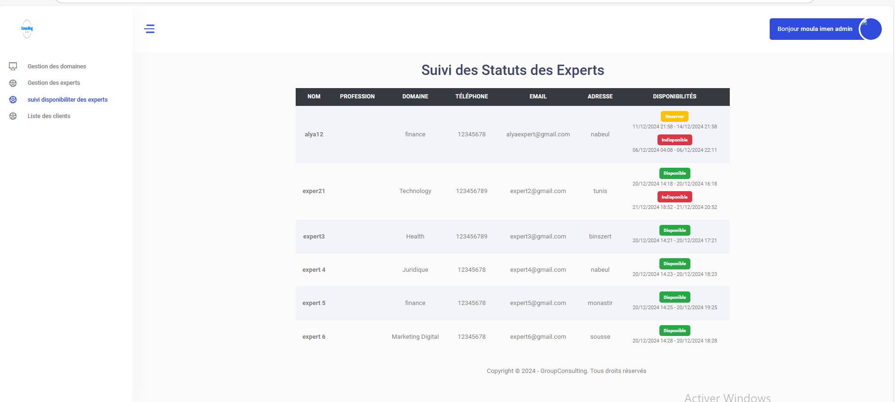
---
## **Installation**

1. **Clonez le dépôt :**
   ```bash
   git clone https://github.com/votre-utilisateur/consulting-expert.git
   cd consulting-expert

1. **Installation des dépendances PHP avec Composer :**Assurez-vous d'avoir Composer installé. Ensuite, exécutez la commande suivante pour installer les dépendances :
   ```bash
         composer install

1. **Exécution des migrations :** Pour configurer la base de données, exécutez la commande suivante pour appliquer les migrations :
 ```bash
 php artisan migrate